# Mind & Body Care - Mindfulness Support Group in Cornwall 

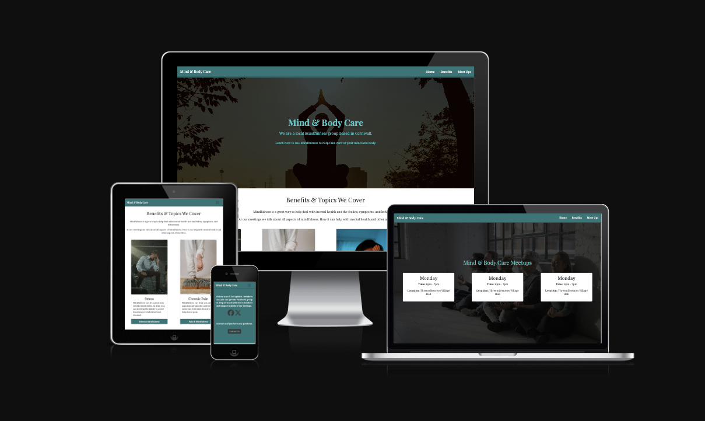

## Purpose 
  Mental health mindfulness website for a local mindfulness group called Mind & Body Care.

  They have meet-ups 3 times a week to allow its members to talk about their challenges and to get advice on how mindfulness can help. 

  It is a great way to learn mindfulness, what it is, why to use it, and how it can help with stress, Sleep, Pain, Blood Pressure and many more….. 

## User Stories 
  User Stories have been setup in Github Issues on the repository 

### Must Have User Stories 

* User Story 1: As a potential new member of the group, I want to be able to see the time, date, and where the group meets [#1](https://github.com/surfdemon/mind-body-care/issues/1)
  * Acceptance Criteria: An area on the site that clearly displays the days and the times that the group meets 
* User Story 2: As a potential new member of the group, I want to be able to see some of the topics that the group talks about [#2](https://github.com/surfdemon/mind-body-care/issues/2)
  * Acceptance  Criteria: An area on the site that highlights some of the topics that are covered by the group. 
* User Story 3: As a new visitor to the site I want to be able to see what some of the benefits are from the group and mindfulness [#3](https://github.com/surfdemon/mind-body-care/issues/3)
  * Acceptance Criteria: An an area on the site thot highlights the benefits of mindfulness and the benefits of the group 

### Should Have User Stories 

* User Story 4: As the organiser of the group, I should be able to receive feedback from visitors to the site with any queries that that have about the group so that I can then reply to them. They shouldn’t be able to contact me without providing a way for me to reply to them. [#4](https://github.com/surfdemon/mind-body-care/issues/4)
  * Acceptance Criteria: The feedback should come through as an email with the visitors feedback/question and include an email address so that I can reply to them via email.
* User Story 5: As a potential new member I want to be able to contact the person that runs the group so I can ask any questions I may have [#5](https://github.com/surfdemon/mind-body-care/issues/5)
  * Acceptance Criteria: I would like a form that lets me write in my questions / queries that can then be sent to the organiser of the group. 

### Could Have User Stories 

* User Story 6: As a member I would like a way to stay in touch with other members of the group outside of the group meetings [#6](https://github.com/surfdemon/mind-body-care/issues/6)
  * Acceptance Criteria: This can be a link to a 3rd party app that allows groups of people to chat such as a slack server with channels for different areas of mindfulness 

## Design Decisions 

### Wireframes 
  Wirfeframes have been created with the Balsamiq Wireframes program.

  [Wireframes PDF](./assets/images/Mind-Body-Care-Wireframes.pdf)

  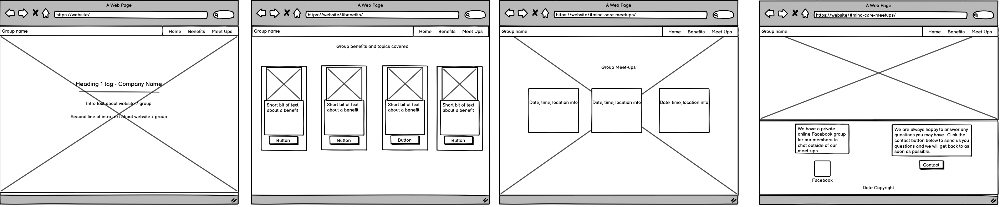
  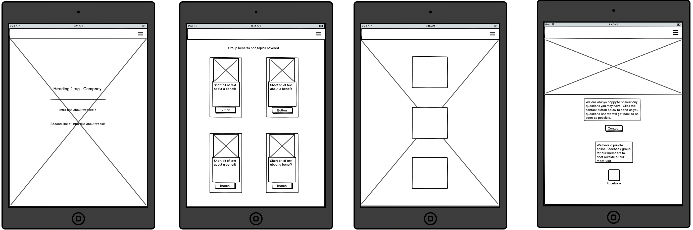
  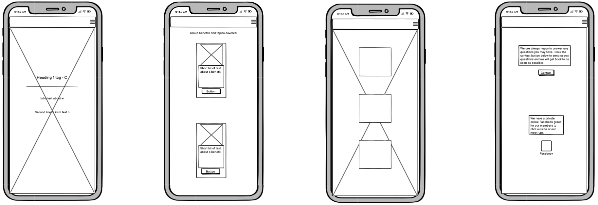

  I have tried to design the website so that it looks clean and modern.

  #### Colours
  For the colours I've tried to pick ones that will suit the look and feel of the site and make it easy on the eye. I also went with blueish colours as I find blue to be a calming colour. 

  * Light Background = #F5F5F5
  * Dark Background = #424242
  * Mid Colour = #229799
  * Light Text = #48CFCB
  * Dark Text = #242424

  

  These have been tested using the [Adobe Color Accessibility](https://color.adobe.com/create/color-accessibility) tool and there are no conflicts.

  Update: Checking the colours on the WCAG Contrast Checker and using [Google PageSpeed Insights](https://pagespeed.web.dev/analysis/https-surfdemon-github-io-mind-body-care/r7xhoqe1p0?hl=en-GB&form_factor=mobile), both said that the mid color and light background colors 
  didn't have enough contrast. So the colours have now changed to the following.
    
  * Light Background = #fff;
  * Mid Colour = #2f8283;
  * Dark Background = #424242;
  * Light Text = #48CFCB;
  * Dark Text = #242424;

  

  This new colour scheme passes Adobe Color blind safe test, WCAG Contrast Checker, and Google PageSpeed Insights Accessibility tests.

  #### Font 
  I have picked two fonts from Google fonts. 

  [Playfair Display](https://fonts.google.com/specimen/Playfair+Display)

  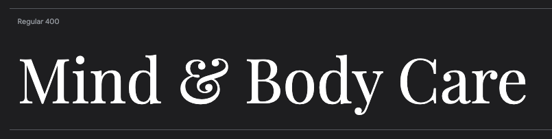

  [Noto Serif Georgian](https://fonts.google.com/noto/specimen/Noto+Serif+Georgian?preview.text=Mind%20%26%20Body%20Care&query=georgia)
  
  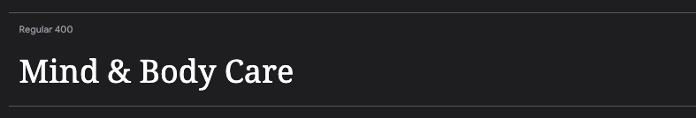
    
  #### Images 
  The images for the site have been selected from [Pexels.com](https://www.pexels.com/)

  #### Icons 
  The icons for the site have been selected from [Font Awesome](https://fontawesome.com/)

  #### Favicon 
  The favicon was created using [Favicon.io](https://favicon.io/favicon-generator/)

  ### AI Tools 
  I have not used any AI tools for the design of the website.
  
## Github 
### Github Issues 
  Github Issues has been used as part of the Agile process for logging user stories. 

  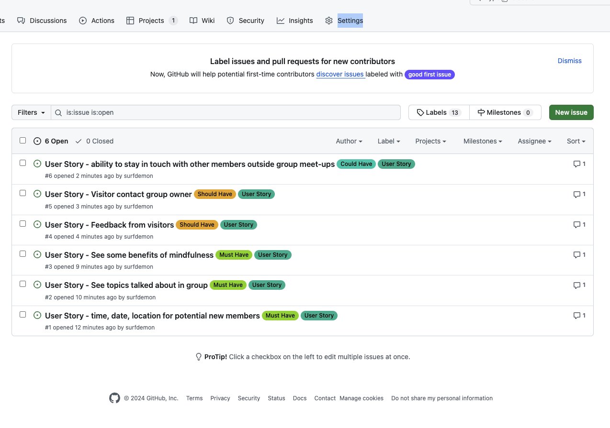

  Github Projects kanban board has been used as part of the Agile process for keeping track of the user stories and their progress through the development process. 

  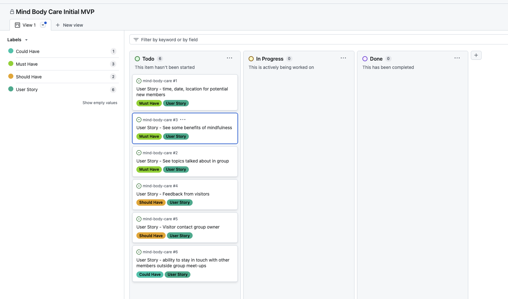

## Features Implementation 

### Navigation 
  The navidagion has been implemented using a Bootstrap navbar without an un-ordered list. It is fixed top so that it stays at the top of the screen as you scroll down the page.

  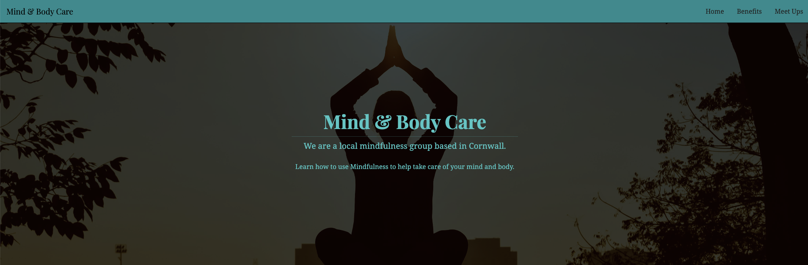

  As it is a Bootstrap navbar it is responsive, with a hamburger menu on smaller screens. I altered it slightly so that when the responsive drop down menu was open the links are on the 
  right hand side of the screen (same side as the menu button) rather than being on the opposit side of the screen as this seem to be an odd location form them. 

  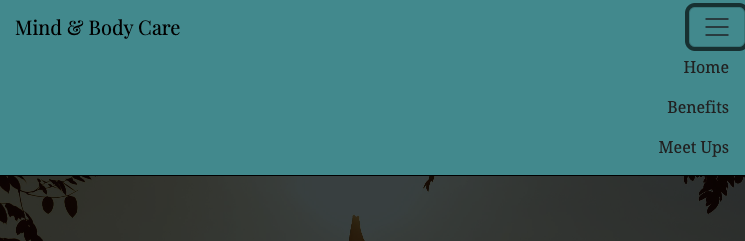

### Core Features (Must Haves)
    
#### User Story 1 
  To implement this there is a section that shows the time, date and location for each of the groups. 

  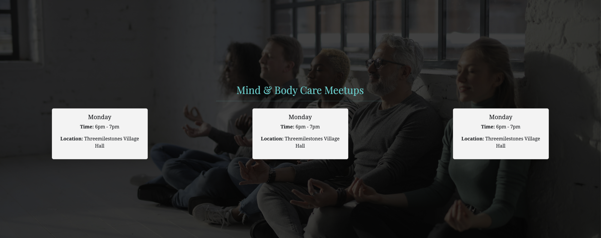

#### User Story 2 & User Story 3
  These two user stories have been combined when implementing as I fealt that the one area covered both user stories. 

  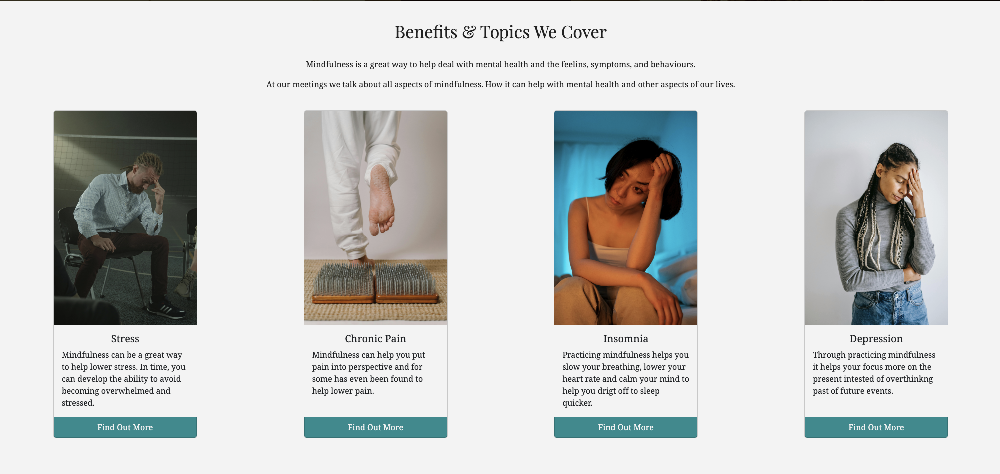

### Advanced Features (Should Haves)

#### User Story 4 & User Story 5 
  These two user stories have been combined when implementing as the same feature covers both of them. 

  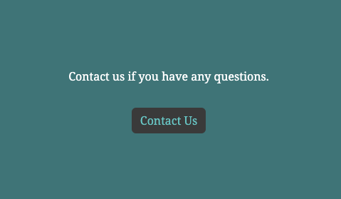

  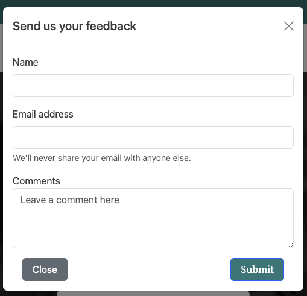

  The cantact form uses Bootstrap modal with Bootstrap form inside it, both altered to fit the site design and requirments.

### Optional Features (Could Haves)

#### User Story 6 
  This is essentially a private Facebook group for members. There is a section for this on the site with a link to Facebook. 

  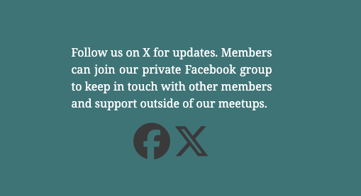

## Testing and Validation 

### Testing Results 
  Colours have been tested with all the utilites mentioned in the colours section above and finally checked with WCAG Contrast Checker plugin. 

  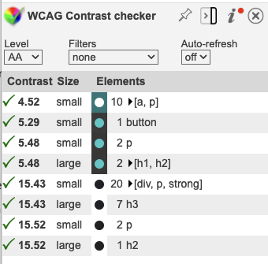

  Performance, Accessibility, Best Practices, and SEO have been tested with [Google PageSpeed](https://pagespeed.web.dev/analysis/https-surfdemon-github-io-mind-body-care/xos9suzk5x?form_factor=mobile&category=performance&category=accessibility&category=best-practices&category=seo&category=pwa&hl=en-GB&utm_source=lh-chrome-ext)

  Mobile PageSpeed Scores 

  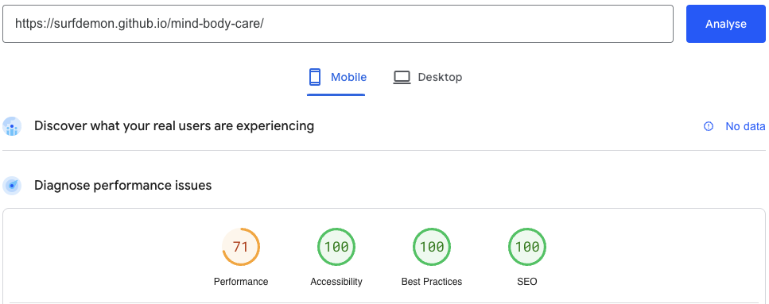

  Desktop PageSpeed Scores 

  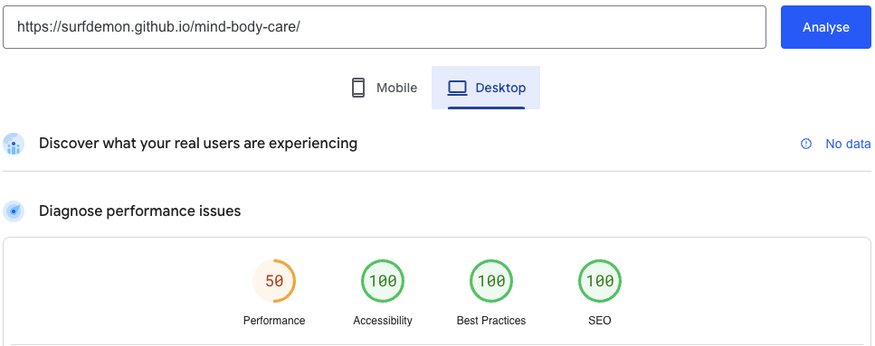

  There are performance issues on both desktop and mobile but these are outside the scope of this project.

### Validation 

 HTML validation has been done with [Validator.w3.org](https://validator.w3.org/) and there are no errors or warnings.

  

  CSS validation has been done with [W3C CSS Validation](https://jigsaw.w3.org/css-validator/) and there are no errors or warnings.

  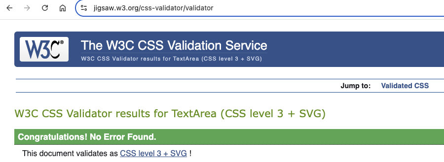

## Deployment 
  The website has been deployed using Github pages and can be viewed at [Mind and Body Care Website](https://surfdemon.github.io/mind-body-care/)

### Deployment Process
  To setup the delpoyment, once the repository has been cloned. Setup Github pages in the pages section of the repositories settings screen. 

  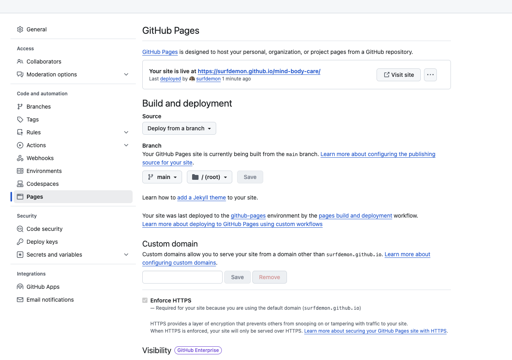

  Once that is setup, every time you push to the repositiory, Github will automatically deploy the website. 

### AI Tools 
  No AI tool were directly used for the deployment apart from any that Github uses.

## Reflection on Developments Process 

### Successess  

### Challenges 

## Final Thoughts 

## Code Attribution 
  
  * Bootstrap components such as the navbar and cards, the base code came from the Bootstrap website, based of their example code and then altered. 
  * Google fonts css snippets taken from the Google fonts site and then altered. 

## Final Improvements
